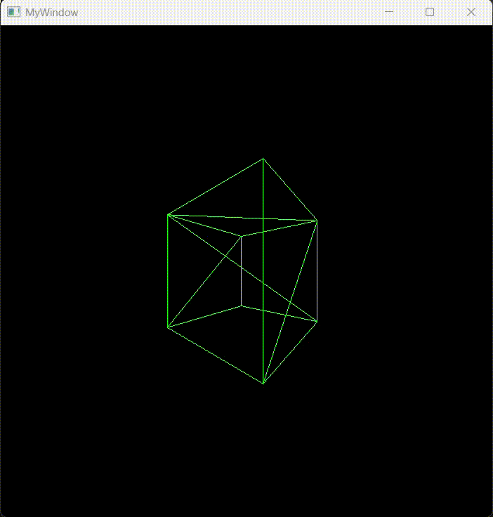

# Simple C++ OpenGL Projects

This repository contains small C++ OpenGL projects created for **educational purposes**. Please note that the code may contain mistakes or incomplete features. If you find any errors or have suggestions for improvements, feel free to open an issue or submit a pull request. Your feedback is always appreciated!

---

## Spinning Cube

A simple OpenGL project that renders a rotating 3D cube.  
This example demonstrates basic 3D transformations, rendering, and animation using OpenGL.

---
