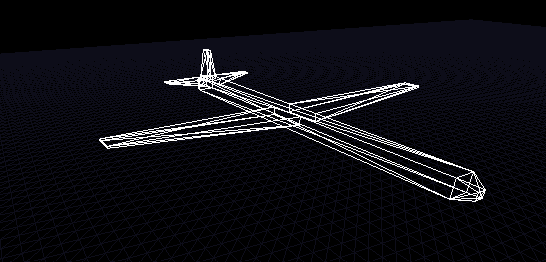
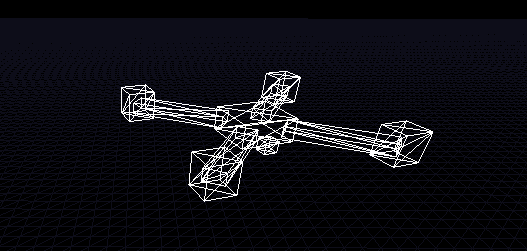
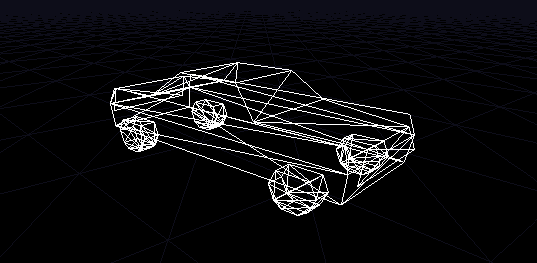
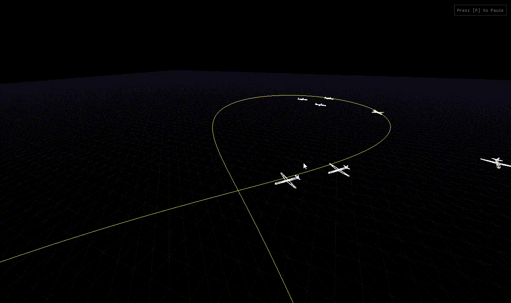

# C++ OpenGL Simulator

This repository contains a lightweight C++ OpenGL-based simulator designed for testing multi-agent trajectory tracking and autonomous vehicle guidance algorithms. The simulator was developed as a flexible alternative to commercial simulation environments, allowing full customization and adaptation to research needs.

---

## Run App

Click `run.bat`

---

## Current Progress

- **Holonomic, Unicycle and Ackermann** kinematic models implemented
- **Trajectory tracking** using Guiding Vector Fields (GVF)
- **Supported trajectories**:
  - Circle trajectory
  - Lemniscate trajectory
- **Multi-agent simulation** support
- **Rendering System** working
- **Camera System** added:
  - Movement controls:
    - `W / A / S / D` → Move
    - `Shift` → Move down
    - `Space` → Move up
- **Ground Grid** visualization added

---

## Available Models

| Airplane                | Drone                | Car                |
| ----------------------- | -------------------- | ------------------ |
|  |  |  |

---

## Demo

---

## Notes

- The implemented GVF-based trajectory tracking strategies provide stable convergence across different kinematic models.
- The virtual coordinate approach enables tracking of trajectories with self-intersections such as the lemniscate.
- The simulator architecture is modular and designed for future extensions and experimentation.

---

## Future Work

Future updates may include:

- Integration of **Control Barrier Functions (CBFs)** into the 3D simulator for collision avoidance
- Improved CBF formulations for Ackermann vehicles considering steering dynamics
- More robust lateral evasion strategies independent of world-axis orientation
- Mixed scenes combining different kinematic models simultaneously
- Inter-agent communication and swarm coordination behaviours
- Physics engine integration for gravity, friction and realistic dynamics
- Enhanced rendering with textures, lighting and shading
- Additional trajectories and configurable environments for testing complex scenarios
